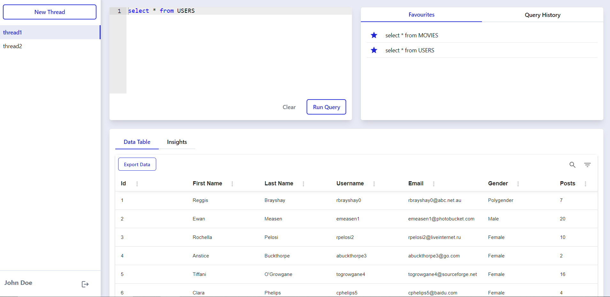
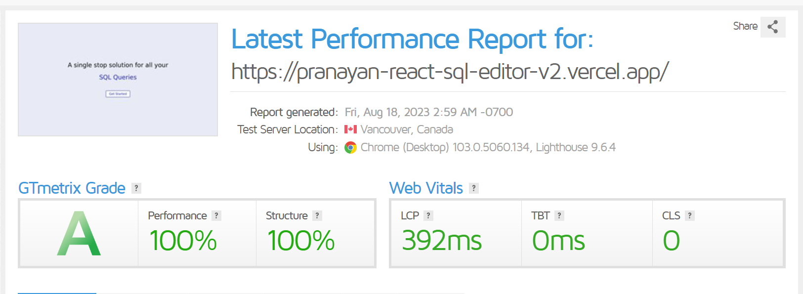
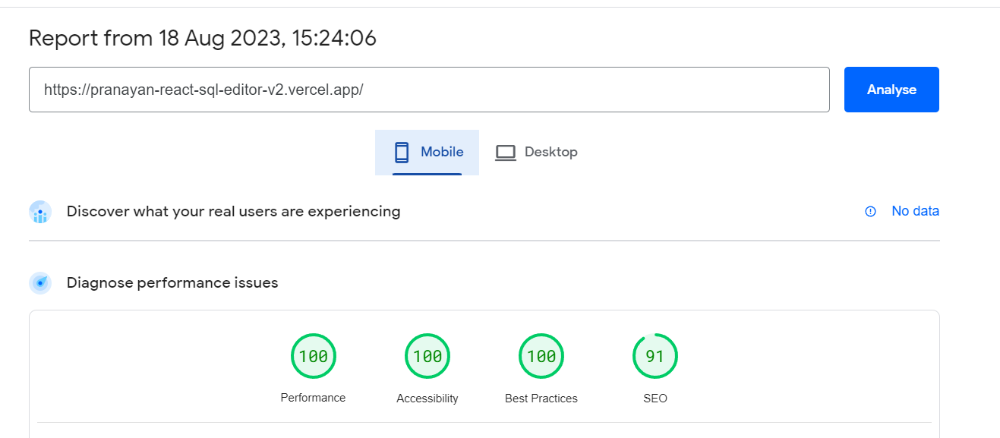
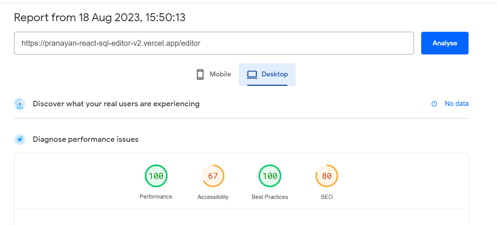
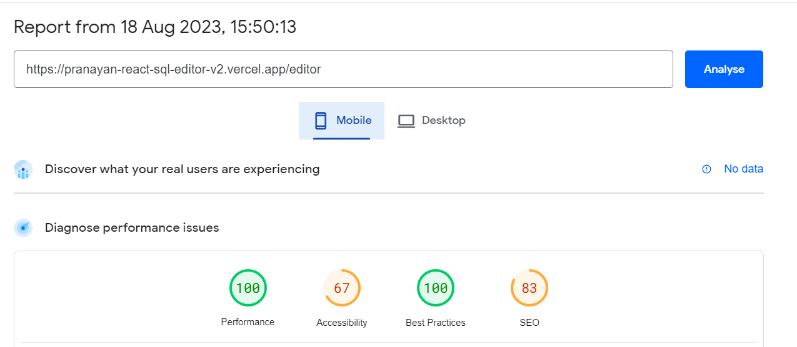

# React SQL Editor v2
## [Hosted on vercel: https://pranayan-react-sql-editor-v2.vercel.app/](https://pranayan-react-sql-editor-v2.vercel.app/)

This is a feature-rich version of the app. I have tried to add functionalities that would commonly be helpful to the user while using this site repeatedly

## Project Overview

The page is divided into two sections: the sidebar on the left and the main area on the right.

### Sidebar
The sidebar contains all the threads created by the user, and the option to logout and return to homepage.

A thread is a chain of related queries. Suppose you're working with 2 tables and have correlate them together. So you can have a thread for Table1 and one for Table2, where you can run queries specific to each table in their respective threads

### Main area

On the left, the editor is present with two buttons:

- Run Query: submits the query written in the editor
- Clear: empties the editor

On the top right, is the Quick Access section with two lists:
- Favourites: commonly used queries. Can add or remove Favourites
- History: list of all the queries run in the current thread

On the bottom is the output section.
- It shows the data in table format.
- The table has filter and search functionalities
- Also has a button to export the data in the table as a CSV file
- There's also an Insights tab which can be used to display results from the data, such as percentage of a certain value or aggregates

## Frameworks and libraries used
- ReactJS with Vite : Vite provides a smaller bundle size thus making the app slightly lighter and faster than create-react-app
- TailwindCSS : to easily add styles without having to write large CSS files
- react-ace : the text editor to enter SQL commands
- react-csv : to allow downloading data in CSV format
- Material UI : to easily build complicated components such as tables and modals
- redux : to configure global store, making it easy for multiple components to access and update certain state variables
- react-router-dom : to enable routing

## Performance Metrics

Since this version has many features and dependencies, performance is not as good as the lightweight version

### GTMetrix:

### Pagespeed Homepage:

### Pagespeed Editor Page:

## Optimisation Attempts

- Used vercel for hosting leverage its Vercel Edge Network compression that results in the better performance.
- Lazy loaded all most components to prevent unresponsive or blank screen when components are being imported
- separated the components and added the data fetching responsibilities in lazy loaded component

## Features that would be helpful in real world scenario but not implementing now

- Persisting threads, history and favourites in localStorage
- Adding rename and delete functionality to threads